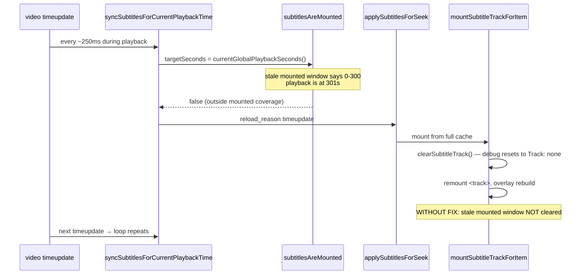

# Subtitle track flickering during compatibility playback

Date observed: 2026-06-30  
Status at time of writing: fix implemented locally (uncommitted)  
Primary module: `dropbox_browser/assets/js/video/subtitles.js`

## Symptoms

During an active compatibility (HLS) playback session with subtitles enabled:

- Debug panel **Track** line flickers rapidly between the real track label and `none`.
- On-screen subtitles flicker or blink.
- Debug cue text may alternate between an active cue and empty / "No active subtitle cue."
- Playback itself continues; only subtitle mounting/display is unstable.

Typical user-visible debug lines:

```text
Track: none
Track: ENG • English (Full) [LostYears] • ASS • Stream 4
Subtitle mode: none
Subtitle mode: webvtt
```

## Repro conditions

The bug appears when all of the following are true:

1. Compatibility playback is running with WebVTT subtitles selected.
2. Startup mounted a **windowed** subtitle payload (`subtitleMountedWindowByPath` recorded a finite range, often the initial 0–300s startup window).
3. Background preload later caches the **full** subtitle VTT via `/video/endpoints/subtitles/all`.
4. Playback position moves **past** the stale mounted-window range (for example global time ~301s when mounted coverage is 0–300s).
5. `timeupdate` events keep firing (normal during playback).

Window-only playback that never gets a full-cache upgrade is a different, intentional code path: remounting when crossing an uncovered window boundary is expected.

## Root cause

A stale **mounted-window metadata** entry outlived the actual subtitle source type.

The player maintains several overlapping subtitle state buckets:

| State key | Purpose |
|-----------|---------|
| `subtitleWindowCacheByPath` | Cached window payloads (VTT snippets + ranges) |
| `subtitleCoverageByPath` | Union of loaded ranges for scrubber / progress UI |
| `subtitleBackgroundCoverageByPath` | Background-fetched ranges |
| `subtitleMountedWindowByPath` | **Narrow range currently considered "mounted"** |
| `subtitleFullVttCacheByPath` | Full-file VTT after `/subtitles/all` preload |

`cachedSubtitleSourceForSeek()` prefers full cache over window cache:

```javascript
// subtitles.js — full cache wins when present
if (fullSubtitleText) return { sourceType: 'full', subtitleText: fullSubtitleText, payload: null };
// else fall back to window payload
```

But `subtitlesAreMounted()` still enforced the old `subtitleMountedWindowByPath` range even after mounts switched to full cache:

```javascript
// subtitles.js — subtitlesAreMounted()
if (activeMountedCoverage) {
  if (!subtitleRangesCoverWindow([activeMountedCoverage], requestedCoverageTarget, requestedCoverageTarget)) {
    return false;  // playback past startup window → "not mounted"
  }
}
```

### Feedback loop



### Why debug and overlay flicker

`mountSubtitleTrackForItem()` always calls `clearSubtitleTrack()` before inserting a new `<track>`:

- `resetSubtitleDebugState()` clears `subtitleDebug.trackLabel` → debug shows `Track: none`.
- Native track nodes are removed and recreated.
- `syncSubtitleOverlayDisplay()` runs on `timeupdate` and sees transient empty state.

`subtitlePlaybackRefreshInFlightKey` only dedupes concurrent in-flight refreshes for the same path/stream/token. Once one remount finishes, the next `timeupdate` can immediately start another because `subtitlesAreMounted()` is still false.

## Log evidence

Source: `Temp/client_logs.jsonl` (client diagnostics via `POST /client-log`).

### Scale

A repo-wide count of `"reload_reason": "timeupdate"` mount starts in the log file at investigation time:

```text
6420 matching lines
```

That volume is not normal steady-state playback; it indicates a remount storm.

### Canonical failing burst (Fruits Basket S02E01, ~301s)

File: `anime/[Trix] Fruits Basket (2019-2022) S01-03+Movie (BD 1080p AV1)/Season 2/[Trix] Fruits Basket (2019) S02E01 (BD 1080p AV1) [6E43C16A].mkv`  
Timestamp cluster: `2026-06-30T00:47:38` – `00:47:42`  
`playback_sync_token`: 12  
`global_current_time`: ~301–305s

Representative sequence (repeats several times per second):

```json
{"message": "Subtitle mount started", "details": {
  "reload_reason": "timeupdate",
  "global_current_time": 301.244677,
  "subtitle_mounted_stream_index": 4,
  "subtitle_track_label": "ENG • English (Full) [LostYears] • ASS • Stream 4"
}}

{"message": "Subtitle mount from cache", "details": {
  "subtitle_cache_source": "full",
  "coverage_target_seconds": 301.244677,
  "subtitle_stream_index": 4
}}

{"message": "Subtitle track mounted", "details": {
  "subtitle_mounted_stream_index": 4,
  "subtitle_stream_index": 4
}}

{"message": "Subtitle cue display changed", "details": {
  "cue_text": "<b>By the way, heading out already, Yuki-kun?</b>",
  "absolute_cue_start": 300.45,
  "absolute_cue_end": 303.03
}}

{"message": "Subtitle mount started", "details": {
  "reload_reason": "timeupdate",
  "global_current_time": 301.662322
}}
```

Key diagnostic fields to grep in future incidents:

```text
reload_reason: timeupdate
subtitle_cache_source: full
Subtitle mount started
Subtitle mount from cache
Subtitle cue display changed
```

### seek-window test fixture (e2e repro)

Same pattern on `Videos/seek-window.mkv` at `global_current_time: 17` after startup window ends at 12s:

```json
{"message": "Subtitle mount started", "details": {
  "path": "Videos/seek-window.mkv",
  "reload_reason": "timeupdate",
  "global_current_time": 17,
  "subtitle_mounted_stream_index": 3
}}
```

Logged at `2026-06-30T00:21:25`, `00:25:07`, `00:28:19`, `00:34:24` during e2e runs.

### Cue flicker signature

Immediately before the remount storm, an empty cue transition is often logged:

```json
{"message": "Subtitle cue display changed", "subsystem": "video-subtitles", "details": {
  "cue_text": "",
  "absolute_cue_start": "",
  "absolute_cue_end": "",
  "global_current_time": 300.983741,
  "subtitle_track_label": "ENG • English (Full) [LostYears] • ASS • Stream 4"
}}
```

### Logging noise note

Many subtitle events appear twice per action (`subsystem: "video"` and `subsystem: "video-subtitles"`). When counting incidents, dedupe by timestamp + message + `global_current_time`, or filter to one subsystem.

`Temp/video_debug.jsonl` captures server-side ffmpeg/HLS/subtitle extraction events. It is useful for extraction failures but does **not** show this client remount loop; use `client_logs.jsonl` for flicker diagnosis.

## Fix (local, 2026-06-30)

When mounting from **full** cache, delete stale per-track mounted-window metadata before clearing/remounting the DOM track:

```javascript
// subtitles.js — mountSubtitleTrackForItem()
if (cachedSource.sourceType === 'full') {
  var staleMountedCoverage = subtitleMountedWindowForPath(item.path || '');
  if (staleMountedCoverage) {
    delete staleMountedCoverage[String(normalized)];
  }
}
clearSubtitleTrack();
// ... create new <track> from rebased full VTT
```

Effect:

- `subtitlesAreMounted()` no longer applies an obsolete finite window after full-cache mount.
- Full-cache mounts do not write a new `subtitleMountedWindowByPath` entry (`storeSubtitleWindowPayload(..., { mounted: true })` only runs when `cachedSource.payload` is a window payload).
- `timeupdate` sync becomes a cheap no-op once the track is active.

### Tests added with the fix

| Test | File | Asserts |
|------|------|---------|
| `full cached subtitles clear stale mounted window coverage and stay mounted past the startup window` | `tests/js/video-subtitles-startup.test.js` | After full-cache mount at t=17 with stale 0–12 window metadata, `subtitlesAreMounted(item, 3, 0, 17)` is true and mounted window entry is cleared |
| `full cached subtitles stay mounted across timeupdate without remount flicker` | `tests/e2e/video-subtitle-switch.integration.spec.js` | 40 synthetic `timeupdate` events produce zero `track-removed` instrumentation events; debug meta does not contain `Track: none` |

All 18 tests in `video-subtitles-startup.test.js` pass after the fix.

## Expected behavior after fix

| Scenario | Expected |
|----------|----------|
| Full cache available, playback past startup window | No `timeupdate` remount loop; stable track label and overlay |
| Window-only cache, playback crosses uncovered range | Single intentional remount; may show brief wait/loading |
| User scrubs or changes subtitle track | Explicit remount with `reload_reason` like `scrub`, `subtitle-track-change` |
| Startup | One mount from startup window or full cache; then stable |

Healthy log grep after fix (during normal full-cache playback):

```text
# Should NOT appear repeatedly during steady playback:
reload_reason: timeupdate + Subtitle mount started
```

## Architecture notes for future hardening

This bug is a **state-model inconsistency**, not a bad cue parser or HLS issue. Useful structural observations for a later refactor review:

### 1. Multiple caches with implicit precedence

Subtitle readiness is inferred from four parallel stores whose precedence is only documented in code paths, not in a single type:

- `subtitleMountedWindowByPath` — DOM mount contract
- `subtitleCoverageByPath` — scrubber / "subtitle-ready" band
- `subtitleFullVttCacheByPath` — whole-file fallback
- `subtitleWindowCacheByPath` — time-window snippets

`cachedSubtitleSourceForSeek()` and `subtitlesAreMounted()` can disagree about what "mounted" means when full cache arrives after a window mount.

**Future direction:** represent mount state as an explicit enum, e.g. `{ mode: 'window' | 'full', range?, streamIndex, seekSeconds }`, instead of inferring from overlapping maps.

### 2. Destructive remount as the only refresh mechanism

`mountSubtitleTrackForItem()` always calls `clearSubtitleTrack()` before re-attaching. Any false-negative in `subtitlesAreMounted()` causes visible flicker because debug state and DOM tracks are wiped every cycle.

**Future direction:** separate "update in-memory parsed cues / overlay" from "replace `<track>` element". Full-cache refreshes at the same seek point may not need DOM teardown.

### 3. High-frequency sync trigger

`controls.js` wires:

```javascript
video.addEventListener('timeupdate', function () {
  syncPlaybackProgress();
  ctx.syncSubtitlesForCurrentPlaybackTime('timeupdate');
  ctx.syncSubtitleOverlayDisplay();
  ctx.syncSubtitleDebugDisplay();
});
```

Any guard bug in `syncSubtitlesForCurrentPlaybackTime` is amplified to ~4 Hz during playback.

**Future direction:** only call sync when playback crosses a coverage boundary (compare last synced global second vs current), or when cache generation changes — not on every `timeupdate`.

### 4. `subtitlesAlreadyActive()` masks guard failure

If `subtitlesAreMounted()` is false but `subtitlesAlreadyActive()` is true (track still on screen or `subtitleDebug.trackLabel` set), sync still triggers a silent remount. That is correct for genuine window-boundary crossings but dangerous when metadata is stale.

**Future direction:** if full cache is present and stream/seek/token unchanged, treat as mounted regardless of old window metadata (the current fix is a minimal version of this rule).

### 5. Mounted metadata write path is narrow; clear path was missing

Mounted window metadata is written in one place:

```javascript
// storeSubtitleWindowPayload(..., { mounted: true })
mountedCoverage[String(subtitleStreamIndex)] = {
  start_seconds: payload.window_start_seconds,
  end_seconds: payload.window_end_seconds,
};
```

Clears previously happened only via broader resets (`clearSubtitleTrack`, item change, `cache.js` path reset) — not when upgrading source type from window → full.

**Future direction:** centralize mount-state transitions:

```text
mountFromWindow(payload) → set mounted window
upgradeToFullCache()     → clear mounted window
clearSubtitleTrack()     → clear all mount metadata
```

### 6. Debug display reads partially-cleared state

`syncSubtitleDebugDisplay()` runs on the same `timeupdate` handler and reads `subtitleDebug.trackLabel || 'none'`. During remount it will always expose intermediate empty state even if the bug were shorter-lived.

**Future direction:** debug panel could show `mountState` from a single authoritative struct rather than ad hoc debug fields reset by `clearSubtitleTrack()`.

## Key code locations

| Function / area | File | Role |
|-----------------|------|------|
| `syncSubtitlesForCurrentPlaybackTime` | `subtitles.js` | `timeupdate` boundary sync; triggers remount when not mounted |
| `subtitlesAreMounted` | `subtitles.js` | Mount contract incl. stale window check |
| `subtitlesAlreadyActive` | `subtitles.js` | Allows silent refresh when track appears active |
| `mountSubtitleTrackForItem` | `subtitles.js` | Clears + remounts `<track>`; fix clears stale window on full mount |
| `cachedSubtitleSourceForSeek` | `subtitles.js` | Full cache precedence over window cache |
| `storeSubtitleWindowPayload` | `subtitles.js` | Writes `subtitleMountedWindowByPath` when `mounted: true` |
| `clearSubtitleTrack` / `resetSubtitleDebugState` | `subtitles.js` | Wipes DOM + debug; causes `Track: none` flash |
| `timeupdate` listener | `controls.js` | High-frequency entry point |
| `compatibilityStartupShouldWaitForSubtitles` | `shared.js` | Also consults `subtitlesAreMounted` for startup gating |
| `handleSubtitleTrackChange` | `tracks.js` | User track switches; uses same mount helpers |

## State initialized in `video.js`

```javascript
subtitleFullVttCacheByPath: Object.create(null),
subtitleWindowCacheByPath: Object.create(null),
subtitleCoverageByPath: Object.create(null),
subtitleBackgroundCoverageByPath: Object.create(null),
subtitleMountedWindowByPath: Object.create(null),
subtitleMountedSeekSeconds: null,
subtitleMountedStreamIndex: null,
subtitlePlaybackRefreshInFlightKey: '',
```

## Verification checklist

After deploying the fix:

1. Play a file that preloads full subtitles (watch for `/video/endpoints/subtitles/all` response).
2. Seek or play past the initial startup window (e.g. >300s or past test fixture 12s boundary).
3. Confirm debug `Track:` line stays on the selected label.
4. Inspect `Temp/client_logs.jsonl` — no repeating `Subtitle mount started` with `reload_reason: timeupdate` during steady playback.
5. Run:
   - `node --test tests/js/video-subtitles-startup.test.js`
   - e2e: `full cached subtitles stay mounted across timeupdate without remount flicker`

## Related plans / context

- `plans/WINDOWED_SUBTITLE_EXTRACTION_PLAN.md` — windowed fetch design that introduced `subtitleMountedWindowByPath`
- `plans/subtitle_performance_improvement.md` — preload / cache strategy
- `docs/video-player.md` — endpoint and client module overview

## Open questions for structural review

1. Should `subtitlesAreMounted()` skip mounted-window enforcement whenever `getCachedFullSubtitleVtt()` is non-empty for the active stream?
2. Should full-cache preload proactively clear `subtitleMountedWindowByPath` when `/subtitles/all` completes, rather than only at next mount?
3. Can `syncSubtitlesForCurrentPlaybackTime` be replaced with edge-triggered checks (coverage boundary crossings only)?
4. Should remount instrumentation (track removal counts per minute) be a client diagnostic metric to catch regressions early?